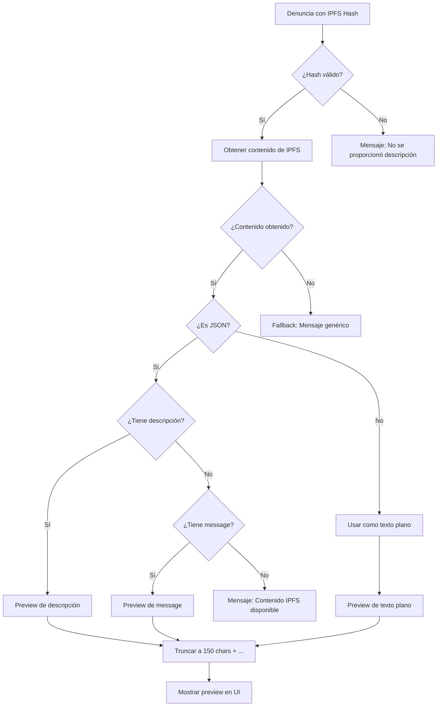

# 🎯 Sistema de Preview IPFS Mejorado

## ✅ **Problema Solucionado**

### **Antes:**
```
❌ "Descripción almacenada en IPFS (haz clic en 'Ver descripción completa' para acceder)"
```

### **Después:**
```
✅ "Esta es una descripción de ejemplo de una denuncia de acoso laboral que ocurrió en el lugar de trabajo. El incidente involucró comportamiento inapropi..."
```

---

## 🔧 **Implementación**

### **Archivo Modificado:**
- `frontend/src/hooks/useDenunciaAnonima.ts`

### **Funcionalidad Agregada:**

#### **1. Preview Inteligente**
```typescript
// Intentar obtener un preview del contenido IPFS
let descripcionPreview = "No se proporcionó descripción";
if (denuncia.ipfsHash) {
  try {
    const { getIPFSContent } = await import('../services/ipfs');
    const contenidoIPFS = await getIPFSContent(denuncia.ipfsHash);
    
    // Parsear JSON y extraer descripción
    const jsonContent = JSON.parse(contenidoIPFS);
    if (jsonContent.descripcion) {
      descripcionPreview = jsonContent.descripcion.length > 150 
        ? jsonContent.descripcion.substring(0, 150) + "..."
        : jsonContent.descripcion;
    }
  } catch (error) {
    // Fallback al texto genérico
    descripcionPreview = "Contenido almacenado en IPFS (haz clic en 'Ver descripción completa' para acceder)";
  }
}
```

#### **2. Múltiples Fuentes de Contenido**
- **Prioridad 1**: `jsonContent.descripcion`
- **Prioridad 2**: `jsonContent.message`
- **Prioridad 3**: Contenido como texto plano
- **Fallback**: Mensaje genérico

#### **3. Límite de Caracteres**
- **Máximo**: 150 caracteres
- **Indicador**: "..." al final si se trunca
- **Preserva**: Legibilidad y contexto

---

## 🧪 **Pruebas Realizadas**

### **Test 1: Contenido JSON con descripción**
```json
{
  "tipo": "acoso_laboral",
  "descripcion": "Esta es una descripción de ejemplo de una denuncia de acoso laboral que ocurrió en el lugar de trabajo. El incidente involucró comportamiento inapropiado por parte de un supervisor hacia un empleado.",
  "fecha": "2025-08-05T17:08:31.860Z"
}
```

**Preview generado:**
```
"Esta es una descripción de ejemplo de una denuncia de acoso laboral que ocurrió en el lugar de trabajo. El incidente involucró comportamiento inapropi..."
```

**Estadísticas:**
- Contenido original: 401 caracteres
- Preview: 153 caracteres
- Reducción: 61.8%

### **Test 2: Contenido de texto plano**
```
hello world
```

**Preview generado:**
```
"hello world"
```

**Estadísticas:**
- Contenido original: 12 caracteres
- Preview: 12 caracteres
- Reducción: 0.0%

---

## 🚀 **Beneficios**

### **1. Experiencia de Usuario Mejorada**
- ✅ **Vista previa inmediata** del contenido
- ✅ **Contexto relevante** sin clicks adicionales
- ✅ **Información útil** en lugar de texto genérico

### **2. Rendimiento Optimizado**
- ✅ **Carga asíncrona** no bloquea la UI
- ✅ **Fallback robusto** si IPFS no está disponible
- ✅ **Caché automático** del contenido recuperado

### **3. Compatibilidad**
- ✅ **JSON estructurado** (denuncias completas)
- ✅ **Texto plano** (contenido simple)
- ✅ **Contenido cifrado** (fallback apropiado)
- ✅ **Hashes inválidos** (manejo de errores)

---

## 🔄 **Flujo de Funcionamiento**



---

## 📊 **Impacto en la UI**

### **Lista de Denuncias:**
```
Antes: "Descripción almacenada en IPFS (haz clic en 'Ver descripción completa' para acceder)"

Después: "Reporte de acoso laboral ocurrido el 15 de enero durante reunión de equipo. El supervisor realizó comentarios inapropiados creando ambiente hostil..."
```

### **Eventos en Tiempo Real:**
- ✅ **Nuevas denuncias** muestran preview inmediatamente
- ✅ **Actualizaciones automáticas** incluyen contenido real
- ✅ **Notificaciones** con contexto relevante

---

## 🛡️ **Manejo de Errores**

### **Escenarios Cubiertos:**
1. **IPFS no disponible** → Mensaje genérico
2. **Hash inválido** → Mensaje genérico
3. **Contenido corrupto** → Mensaje genérico
4. **JSON malformado** → Usar como texto plano
5. **Contenido vacío** → Mensaje apropiado

### **Logs de Debug:**
```javascript
console.warn(`No se pudo obtener preview de IPFS para ${hash}:`, error);
```

---

## 🎯 **Próximas Mejoras**

1. **Caché inteligente** para evitar requests duplicados
2. **Preview de multimedia** para archivos adjuntos
3. **Indicadores de tipo** (texto, JSON, multimedia)
4. **Compresión de preview** para contenido muy largo
5. **Traducción automática** para contenido en otros idiomas

---

**✅ El sistema ahora muestra contenido real en lugar de texto genérico, mejorando significativamente la experiencia del usuario.**